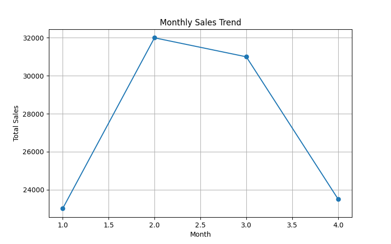
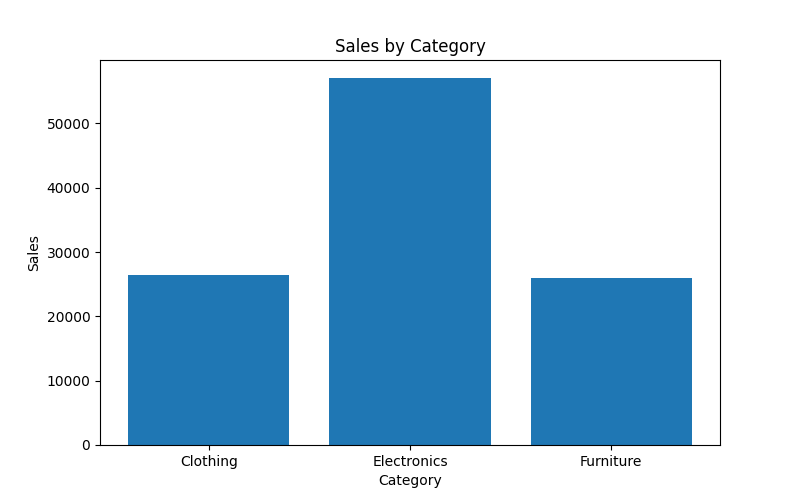
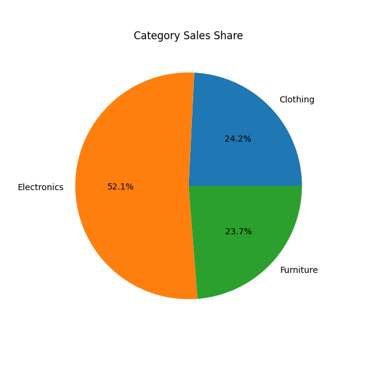

# Syntecxhub Sales Analysis Project

## Project Overview
This project focuses on analyzing sales data using Python data visualization techniques. The goal is to understand sales trends over time and compare sales performance across different product categories.

## Objectives
- Analyze sales trends using a line chart
- Compare category sales using a bar chart
- Show category sales distribution using a pie chart
- Demonstrate basic data visualization techniques

## Tools and Technologies
- Python
- Pandas
- Matplotlib
- Seaborn

## Dataset
The dataset contains:
- Date of sales
- Product category
- Sales amount

## Visualizations

### Monthly Sales Trend (Line Chart)

This chart shows how sales change over time.

### Category Sales Comparison (Bar Chart)

This chart compares total sales across different categories.

### Sales Distribution (Pie Chart)

This chart shows the percentage contribution of each category.

## Conclusion
This project shows how visualization techniques help to understand sales patterns and category performance. Data visualization makes it easier to identify trends and insights from data.
